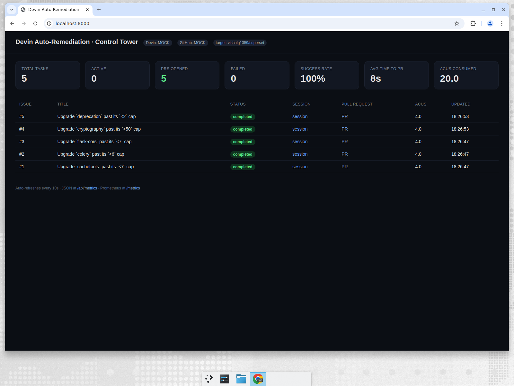

# Devin Auto-Remediation Bot

**Dependabot bumps the version number. Devin does the engineering to make the
upgrade actually work — and opens a green, mergeable PR.**

An event-driven automation that scans a repository for outdated dependencies
(libraries pinned below a newer major), then spins up a [Devin](https://devin.ai)
session per upgrade via the Devin API. Each session raises the version, fixes
the code that breaks under the new major, runs the tests, and opens a pull
request — with a live "control tower" dashboard so an engineering leader can
see at a glance that it's working.

Built as a reference implementation for adopting Devin as an autonomous
engineering primitive, targeting a fork of
[apache/superset](https://github.com/apache/superset).



---

## Why this matters (the business case)

Major dependency upgrades are one of the most expensive, most deferred chores in
any mature codebase. Companies freeze on old versions for *years* because the
upgrade isn't a one-line version bump — it's days-to-weeks of cross-cutting code
surgery: APIs get renamed or removed, signatures change, deprecations turn into
errors, and someone has to fix every call site and get the tests green.

Dependabot opens the version-bump PR and stops there. When the new major breaks
the code, that PR just rots. This system finishes the job: each outdated
dependency becomes a **Devin session** that does the actual engineering and
hands back a reviewed, mergeable PR. Humans stay in the loop at the two points
that matter — **choosing which upgrades to take** and **approving the PR** — and
hand the tedious middle to an autonomous agent.

> **Why Devin specifically?** Dependabot can bump a version string; a linter can
> flag a deprecation. Neither can read the new library's changed API, navigate a
> large unfamiliar codebase, rewrite every broken call site, run the tests, and
> open a coherent PR. That end-to-end engineering loop is exactly what an
> autonomous coding agent provides — and it's the expensive part Dependabot
> leaves undone.

---

## Architecture

```
                    ┌─────────────────────────────────────────────┐
   dependency scan  │                Remediation Bot               │
   (event source)   │                                              │
        │           │   ┌──────────┐      ┌──────────────────┐     │
        │  /scan     │   │ Triggers │────▶ │   Orchestrator   │     │
        └───────────▶│   │ • scan   │      │ • file issue     │     │
                    │   │ • webhook│      │ • dedupe         │     │
        (or timer) ──┼──▶│ • poller │      │ • concurrency cap│     │
                    │   └──────────┘      └────────┬─────────┘     │
                    │                              │ create/poll   │
                    │        ┌─────────────────────▼───────────┐   │
                    │        │        Devin API client         │───┼──▶ Devin sessions
                    │        │   (live  ⇄  mock, same iface)   │   │      └─▶ opens PRs
                    │        └─────────────────────┬───────────┘   │
                    │                              │ status/PR      │
                    │        ┌─────────────────────▼───────────┐   │
                    │        │        SQLite task store         │   │
                    │        └─────────────────────┬───────────┘   │
                    │           ┌──────────────────▼────────────┐  │
                    │           │  Observability                │  │
                    │           │  • / dashboard  • /api/metrics │  │
                    │           │  • /metrics (Prometheus)       │  │
                    └───────────┴────────────────────────────────┘
```

### Key design decisions

| Decision | Why |
| --- | --- |
| **Scan-results trigger** | The primary event: a dependency scan flags outdated deps and each finding fires the pipeline. Emulates a CI job / cron / scanner webhook calling `/scan`. |
| **Files an issue per finding** | Each finding becomes a labeled GitHub issue *before* Devin starts — so the work is auditable and humans can veto an upgrade by closing the issue. |
| **Three trigger modes** | `/scan` (scan-results), a **GitHub webhook** (issue events), and a **scheduled poller** — so the system is demoable without a public URL and hits multiple event styles. |
| **Mock ⇄ live Devin client, one interface** | The whole pipeline runs, tests, and demos with **zero secrets and zero ACUs**. Add an API key and it's production behavior — nothing else changes. |
| **Concurrency cap + ACU ceiling** | Cost and blast-radius guardrails: never more than N sessions at once, bounded ACUs each. |
| **Idempotent intake keyed by `repo#issue`** | The same issue is never worked twice, even if the webhook fires repeatedly. |
| **Reconciler loop** | Session status is polled on a timer and reconciled into the store; PR links and ACUs are recorded and posted back to the issue. |
| **SQLite as single source of truth** | The dashboard and metrics are pure reads over one table — simple, inspectable, no extra infra. |

---

## Quick start (fully mocked — no secrets)

```bash
docker compose up --build        # starts on http://localhost:8000
# in another terminal:
python scripts/simulate.py       # fires a scan-results event at the bot
open http://localhost:8000/      # watch the control tower
```

`scripts/simulate.py` calls the `/scan` trigger. The scanner reads the target
repo's `pyproject.toml` (or a curated set of real Superset caps when none is
configured), files an issue per outdated dependency, and dispatches a Devin
session for each — the full pipeline, no secrets, no ACUs.

Or without Docker:

```bash
python -m venv .venv && source .venv/bin/activate
pip install -r requirements.txt
uvicorn app.main:app --reload
python scripts/simulate.py
```

In mock mode the Devin client simulates the full session lifecycle
(`running → PR opened → completed`, with an occasional failure) so you can see
every state — including failure handling — without spending ACUs.

## Going live

Copy `.env.example` to `.env` and fill in:

- `DEVIN_API_KEY` — real Devin sessions (get it from the Devin app → API Keys).
- `GITHUB_TOKEN` — lets the bot read issues and comment status back.
- `TARGET_REPO` — your Superset fork, e.g. `you/superset`.
- `GITHUB_WEBHOOK_SECRET` — shared secret to verify inbound webhooks.

Then:

```bash
# Option A — fire a scan directly (files issues + starts Devin in one step):
curl -X POST http://localhost:8000/scan

# Option B — just create the issues in your fork (Part 1), then trigger later:
python scripts/seed_issues.py

# Option C — enable the scheduled scanner so it runs on a timer:
ENABLE_POLLING_TRIGGER=true docker compose up --build
```

Point `SCAN_PYPROJECT_PATH` at your Superset checkout's `pyproject.toml` to scan
the real dependency list, or leave it blank to use the curated Superset caps.

Set `SCAN_VERIFY_AVAILABLE=true` to have the scanner check each capped
dependency against PyPI and **drop no-op caps** — an upper bound like `<7` when
the newest release is already `6.x` isn't a real upgrade, so it's filtered out.
This keeps a live run from opening sessions for dependencies that have nothing
newer to move to. (Off by default so offline demos stay deterministic.)

---

## Replay a recorded run (free, repeatable demo)

A real run spends ACUs once. To demo it repeatedly at **zero cost**, record the
completed run to a fixture and replay it:

```bash
# after a live run, capture its real session/PR links + ACUs:
DATABASE_PATH=data/live_run.db python -m scripts.record_run demo/real_run.json

# then replay it — the dashboard re-animates the same fan-out, resolving to the
# REAL PRs Devin opened, without calling the API:
DEMO_REPLAY_FIXTURE=demo/real_run.json uvicorn app.main:app
```

In replay mode the Devin badge reads **REPLAY**, and every "Run scan" replays
the recorded run — genuine Devin PRs, real numbers, `$0` per demo. Precedence is
`replay → live → mock`, so a saved fixture always wins for presentations.

---

## Observability — "how do I know it's working?"

| Surface | What it shows |
| --- | --- |
| **`/` dashboard** | Live control tower: totals, active tasks, PRs opened, failures, **success rate**, **avg time-to-PR**, ACUs consumed, and a per-issue table linking to each Devin session and PR. Auto-refreshes. |
| **`/api/metrics`** | The same numbers as JSON, for dashboards/alerting. |
| **`/metrics`** | Prometheus text format, for scraping into Grafana. |
| **`/api/tasks`** | Full task list as JSON. |
| **Structured logs** | Every lifecycle transition is logged. |
| **Issue comments** | Devin's session link and resulting PR are posted back on each issue — observability where the engineer already looks. |

---

## API

| Method | Path | Purpose |
| --- | --- | --- |
| `POST` | `/scan` | **Primary event trigger**: run a dependency scan and dispatch a Devin session per finding. Optional body `{"repo": ...}`. |
| `POST` | `/webhook/github` | Event-driven trigger (GitHub `issues` events; verifies signature). |
| `POST` | `/simulate/issue` | Manual single-issue trigger for demos/tests (`{"number","title","body"}`). |
| `GET` | `/` | HTML dashboard. |
| `GET` | `/api/tasks` | Tasks as JSON. |
| `GET` | `/api/metrics` | Metrics as JSON. |
| `GET` | `/metrics` | Prometheus metrics. |
| `GET` | `/healthz` | Liveness + mode flags. |

## Tests

```bash
pytest -q
```

Covers prompt construction, idempotent intake, the concurrency cap, the
reconcile→PR→completed lifecycle, and queue promotion.

---

## How I'd extend this in a real customer engagement

- **Human-in-the-loop gates** — require a maintainer 👍 on the issue before Devin
  starts; auto-request review on the PR.
- **Source the work automatically** — feed issues from a vulnerability scanner
  (Snyk/Dependabot/Trivy), Sentry errors, or SLA-breaching Jira tickets.
- **Fleet scale** — one bot fanning out across many repos, with per-team
  concurrency and budget policies.
- **Close the loop on CI** — watch the PR's checks and send Devin follow-up
  messages to fix failures until green.
- **Tie metrics to their KPIs** — engineer-hours reclaimed, mean-time-to-remediate,
  backlog burn-down — surfaced in their existing Grafana.
